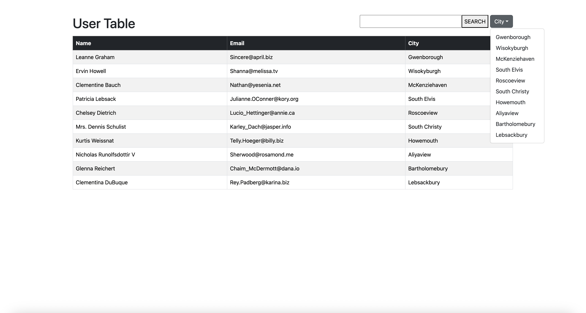
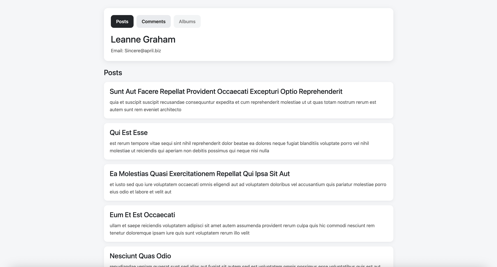

# API-USERS

## Description

API Users is a small mock project that displays a table of users and their basic information. The application allows users to filter the list by name using the search bar or by selecting a specific city from the dropdown menu.

The data is fetched from an external API that provides a mock user database. When clicking on a user's name in the table, the application navigates to that user's dedicated page. On this page, you can view additional information about the user along with their posts, comments, and albums.

The project focuses on simple UI design and demonstrates common front-end concepts such as API requests, state management, filtering data, and page navigation using React Router.


## Technologies used

CSS, Bootstrap, React, React Router. API end Point https://jsonplaceholder.typicode.com/users


## Screenshots






## How to Run This Project

```bash
# Clone the repository
git clone https://github.com/fabioesilveira/API-USERS.git

# Enter the project folder
cd API-USERS

# Install dependencies
npm install

# Start the development server
npm run dev

