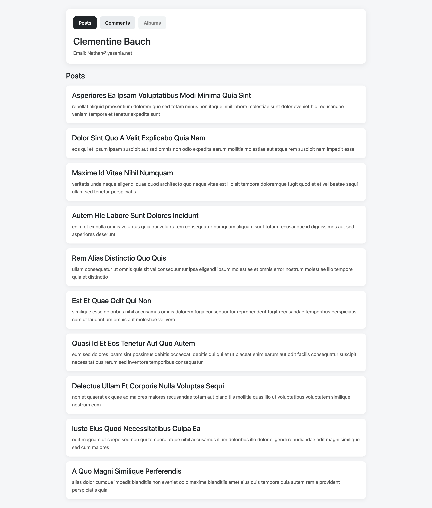

# API-USERS

## Description

API Users is a small practice project focused on working with external APIs. 
It fetches user data from a public API, displays it in a table, and allows filtering users by name or city.


## Technologies used

CSS, Bootstrap, React.Js. API end Point https://jsonplaceholder.typicode.com/users


## Screenshots





## How to Run This Project

```bash
# Clone the repository
git clone https://github.com/fabioesilveira/API-USERS.git

# Enter the project folder
cd API-USERS

# Install dependencies
npm install

# Start the development server
npm run dev
