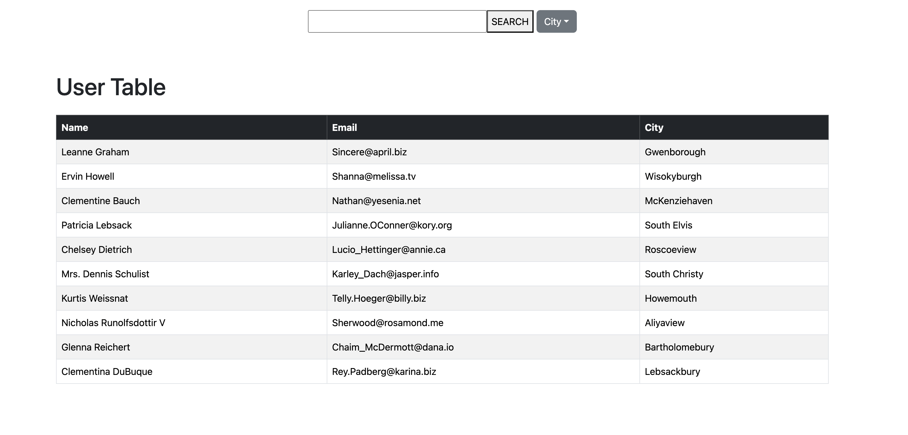
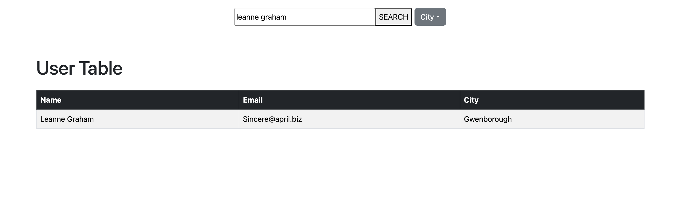
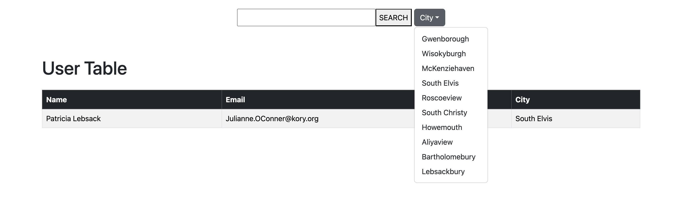

# API-USERS

## Description

API Users is a mock project that displays a table of users and their information. You can filter users by name or the city they reside in. It uses an API with its own user database.

## Technologies used

CSS, Bootstrap, React.Js. API end Point https://jsonplaceholder.typicode.com/users

## Credits

Project By Fabio Silveira.

## Deployed Site

[Live Demo Link]()
